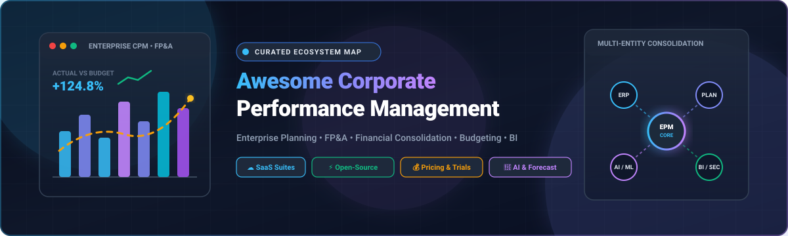

<p align="center">
  
</p>

# Awesome Corporate Performance Management (CPM) 📊 🚀

<p align="center">
  <a href="https://github.com/ishandutta2007/Awesome-Awesome-Awesome"></a><a href="https://discord.gg/jc4xtF58Ve"></a>
  <a href="https://github.com/ishandutta2007/Awesome-Corporate-Performance-Management/stargazers"></a>
  <a href="https://github.com/ishandutta2007/Awesome-Corporate-Performance-Management/network/members"></a>
  <a href="https://github.com/ishandutta2007/Awesome-Corporate-Performance-Management/pulls"></a>
  <a href="https://github.com/ishandutta2007/Awesome-Corporate-Performance-Management/blob/main/LICENSE"></a>
  <a href="https://github.com/ishandutta2007"></a>
</p>

---

## 🌟 Executive Summary & Ecosystem Overview

Welcome to the definitive, community-curated ecosystem map of **Corporate Performance Management (CPM)**, **Enterprise Performance Management (EPM)**, and **Financial Planning & Analysis (FP&A)** solutions.

Corporate Performance Management encompasses the software, methodologies, and data pipelines that enable organizations to **plan, budget, forecast, model scenarios, consolidate multi-entity financial results, accelerate month-end financial close, perform variance analysis, and generate board-ready management reporting** across corporate finance and operational business units.

```text
┌─────────────────────────────────────────────────────────────────────────────────────────────────────────┐
│                                CORPORATE PERFORMANCE MANAGEMENT (CPM / EPM)                             │
├───────────────────┬───────────────────┬───────────────────┬─────────────────────┬───────────────────────┤
│   📈 Planning &   │ 🏢 Financial      │ 🔮 Forecasting &  │ 📑 Management &     │ ⚡ Operational xP&A   │
│     Budgeting     │   Consolidation   │   Scenario Model  │   Board Reporting   │   & Workflows         │
├───────────────────┼───────────────────┼───────────────────┼─────────────────────┼───────────────────────┤
│ • Driver-Based    │ • Intercompany    │ • Rolling 12-Mo   │ • Multi-GAAP / IFRS │ • Workforce Planning  │
│ • Bottom-Up / Top │ • FX Translation  │ • Machine Learn   │ • Variance & Margin │ • Sales & Quota Model │
│ • Cost Allocation │ • Minority NCI    │ • Sensitivity/What│ • SEC & ESG Filing  │ • Supply Chain Plan   │
└───────────────────┴───────────────────┴───────────────────┴─────────────────────┴───────────────────────┘
```

This guide tracks both high-end **commercial SaaS/hosted platforms** (complete with verified starting pricing benchmarks and free trial parameters) and **open-source GitHub building blocks** (with live social star badges) that developers and data engineering teams can leverage to assemble composable, sovereign corporate performance architectures.

---

## 📑 Table of Contents

* [☁️ SaaS & Enterprise Hosted Platforms](#-saas--enterprise-hosted-platforms)
* [⚡ Open-Source GitHub Projects](#-open-source-github-projects)
* [🔬 Additional Open-Source & Research Building Blocks](#-additional-open-source--research-building-blocks)
  * [🏛️ Financial Management & ERP Foundations](#️-financial-management--erp-foundations)
  * [📈 Budgeting, Planning & Corporate Modeling](#-budgeting-planning--corporate-modeling)
  * [🔮 Forecasting, Machine Learning & Scenario Modeling](#-forecasting-machine-learning--scenario-modeling)
  * [📊 Business Intelligence, OLAP & Management Dashboards](#-business-intelligence-olap--management-dashboards)
  * [🗄️ Analytical Databases & High-Performance Engines](#️-analytical-databases--high-performance-engines)
  * [🔄 Data Integration, ELT & Semantic Transformation](#-data-integration-elt--semantic-transformation)
  * [⚙️ Workflow Automation & Financial Process Orchestration](#️-workflow-automation--financial-process-orchestration)
* [🏗️ Building a Custom Open-Source CPM Architecture](#️-building-a-custom-open-source-cpm-architecture)
* [💡 Important Corporate Performance Management Concepts](#-important-corporate-performance-management-concepts)
* [🤝 How to Contribute](#-how-to-contribute)
* [📈 Star History](#-star-history)
* [⚖️ Disclaimer](#️-disclaimer)

---

## ☁️ SaaS & Enterprise Hosted Platforms

The table below catalogs premier **SaaS, Cloud, and Hosted Enterprise CPM / EPM / FP&A Platforms**, sorted in **descending order by company size** (market capitalization, private equity acquisition valuation, or annual revenue).

> [!NOTE]
> All pricing figures represent verified **entry-level starting tier pricing benchmarks** or published subscription rates. Free trial limits reflect exact durations and sandbox scopes.

| # | 🏢 Platform / Suite | 🌐 Company Size (Valuation / Revenue) | 💰 Starting Tier Pricing | ⏱️ Free Tier & Trial Limits | 🎯 Key Capabilities & CPM Focus |
|:---:|:---|:---|:---|:---|:---|
| 1 | **[Oracle Fusion Cloud EPM](https://www.oracle.com/performance-management/)** | **Market Cap: ~$400B+**<br>Revenue: ~$53B+ *(Oracle Corp)* | **$250.00 / user / month** *(Standard Edition, 10-user min = $30,000/yr)*; **$500.00 / user / month** *(Enterprise Edition, 25-user min = $150,000/yr)* | **No free trial for Cloud EPM SaaS** *(OCI 30-day $300 credit free tier excludes EPM; custom demo & POC sandbox available via sales)* | Comprehensive enterprise suite covering planning, budgeting, financial close & consolidation, narrative reporting, account reconciliation, tax reporting, and enterprise data management (EDM). |
| 2 | **[Oracle Hyperion](https://www.oracle.com/applications/epm/)** | **Market Cap: ~$400B+**<br>Revenue: ~$53B+ *(Oracle Corp)* | **$250.00 / user / month** *(Cloud EPM transition)* or perpetual on-prem from **~$9,000 / license** + 22% annual maintenance | **No free trial** *(On-premises perpetual licensing and enterprise cloud migration; custom demo / proof of concept upon request)* | Proven enterprise EPM platform for multi-entity consolidation, financial management (HFM), planning, profitability analysis, and financial reporting. |
| 3 | **[SAP Analytics Cloud](https://www.sap.com/products/technology-platform/cloud-analytics.html)** | **Market Cap: ~$250B+**<br>Revenue: ~$34B+ *(SAP SE)* | **$24.00 – $36.00 / user / month** *(Standard BI Edition)*; Enterprise Planning edition: **$100.00+ / user / month** | **30-Day Free Trial** *(Full access to shared cloud tenant with BI, augmented analytics, and planning templates; extendable up to 90 days upon request)* | Unified cloud analytics and planning combining enterprise FP&A, budgeting, predictive forecasting, scenario modeling, and live SAP S/4HANA ERP connectivity. |
| 4 | **[IBM Planning Analytics](https://www.ibm.com/products/planning-analytics)** | **Market Cap: ~$200B+**<br>Revenue: ~$62B+ *(IBM Corp)* | **$875.00 / month per instance** *(Essentials Plan base)* + **$79.50 / user / month** for additional authorized users *(+$477/mo per 16 GB RAM)* | **30-Day Free Trial** *(Full cloud sandbox access with sample financial data, multidimensional modeling engine, and pre-built analytical workspaces)* | Multidimensional planning and analytics powered by the TM1 in-memory OLAP engine, supporting budgeting, forecasting, scenario planning, driver-based modeling, and management reporting. |
| 5 | **[IBM Cognos Analytics](https://www.ibm.com/products/cognos-analytics)** | **Market Cap: ~$200B+**<br>Revenue: ~$62B+ *(IBM Corp)* | **$10.60 / user / month** *(On-Demand Standard Tier)*; Premium Tier: **$42.40 / user / month** | **30-Day Free Trial** *(Includes full Premium Tier functionality, AI assistant, forecasting, and data exploration, capped at **5 users**)* | Enterprise business intelligence, automated report authoring, AI-assisted dashboards, forecasting, and performance analytics often paired with Planning Analytics. |
| 6 | **[Workday Adaptive Planning](https://www.workday.com/en-us/products/adaptive-planning/overview.html)** | **Market Cap: ~$65B+**<br>Revenue: ~$7.3B+ *(Workday, Inc.)* | **$25,000 – $35,000 / year** *(Starter base)*; 20-user mid-market pack lists at **~$135,000 / year** *(discounted at $94,000–$108,000/yr)*; Workday HCM add-on: $20–$40 PEPY | **30-Day Free Trial** *(Guided interactive cloud trial environment with core budgeting, workforce planning, and financial modeling templates)* | Collaborative enterprise planning, continuous forecasting, workforce planning, operational modeling, and multi-scenario analysis with Elastic Hyperdrive engine. |
| 7 | **[CCH Tagetik](https://www.wolterskluwer.com/en/solutions/cch-tagetik)** | **Market Cap: ~$40B+**<br>Revenue: ~$6.4B+ *(Wolters Kluwer)* | **$25,000 – $50,000 / year** *(Entry-level base subscription)*; mid-market/enterprise suites range **$75,000 – $150,000+ / year** | **No free trial** *(Custom interactive product demos and scoped Proof of Concept engagements available upon sales request)* | Enterprise CPM suite for complex multi-GAAP/IFRS financial consolidation, budgeting, ESG reporting, cash-flow planning, and regulatory disclosure. |
| 8 | **[Sage Intacct](https://www.sage.com/en-us/products/sage-intacct/)** | **Market Cap: ~$15B+**<br>Revenue: ~$2.8B+ *(The Sage Group plc)* | **$9,000 – $15,000 / year** *(~$750 – $1,250/mo base; ~$400–$800/user/mo equivalent)*; typical mid-market: **$25,000 – $50,000 / year** | **30-Day Free Trial** *(Access to personal sandbox environment preloaded with sample multi-entity financial data; self-guided interactive tour available)* | Cloud financial management and accounting platform with native budgeting, multidimensional general ledger, multi-entity consolidation, and FP&A integrations. |
| 9 | **[Anaplan](https://www.anaplan.com/)** | **Valuation: $10.4B** *(Thoma Bravo)*<br>Revenue: ~$600M+ | **$30,000 – $50,000 / year** *(Entry-level platform base)*; user tiers range from ~$156/yr *(viewers)* to ~$9,000+/yr *(model builders)* | **No public free trial** *(Personalized demos and temporary workspace access provided during official 'Anaplan Way' training and partner certifications)* | Hyper-scalable connected enterprise planning platform spanning FP&A, supply chain, workforce modeling, sales territory/quota planning, and dynamic scenario modeling with Polaris/Hyperblock calculation engine. |
| 10 | **[OneStream](https://www.onestream.com/)** | **Valuation: $6.4B** *(Hg Capital)*<br>Revenue: $601.9M *(FY2025)* | **$178,000 – $250,000 / year** *(Mid-market starter base subscription)*; enterprise deployments range **$300,000 – $1,000,000+ / year** | **No free trial** *(Personalized live demos, architecture workshops, and structured Proof of Concept evaluations arranged via enterprise sales)* | Unified enterprise CPM platform integrating financial close, consolidation, planning, budgeting, operational analytics, machine learning (Sensible ML), and reporting in a single extensible architecture. |
| 11 | **[Workiva](https://www.workiva.com/)** | **Market Cap: ~$3.8B – $4.0B**<br>Revenue: $885M *(FY2025)* | **$25,000 – $35,000 / year** *(Single-solution starter package)*; comprehensive multi-module enterprise suites range **$80,000 – $150,000+ / year** | **No free trial** *(Personalized live product demonstrations and enterprise Proof of Concept workshops available upon sales consultation)* | Cloud platform for connected financial reporting, SEC compliance filings (10-K, 10-Q), ESG disclosures, audit, SOX internal controls, and management report narrative linking. |
| 12 | **[Workiva Wdesk](https://www.workiva.com/)** | **Market Cap: ~$3.8B – $4.0B**<br>Revenue: $885M *(FY2025)* | **$25,000 – $35,000 / year** *(Baseline mid-market deployment)*; enterprise configurations range **$30,000 – $150,000+ / year** | **No free trial** *(Guided solution walkthroughs and customized Proof of Value pilots upon request)* | Dynamic document and spreadsheet linking engine ensuring synchronized financial data across board decks, SEC filings, ESG reports, and internal management books. |
| 13 | **[BlackLine](https://www.blackline.com/)** | **Market Cap: ~$3.5B – $4.0B**<br>Revenue: $590M | **$13,000 – $25,000 / year** *(Entry-level mid-market range)*; typical mid-market spend: **$13,000 – $120,000 / year**; enterprise: **$200,000 – $500,000+ / year** | **No free trial** *(Customized live workflow demos and scoped Proof of Concept pilots available upon sales consultation)* | Financial close automation, automated account reconciliation, high-volume transaction matching, journal entry management, and intercompany financial governance. |
| 14 | **[Infor EPM](https://www.infor.com/solutions/technology/enterprise-performance-management)** | **Revenue: ~$3.5B+**<br>*(Infor / Koch Industries)* | **£110 / user / month** *(~$140 – $150 / user / month)* or Infor CloudSuite user tier at **$200 – $400 / user / month**; entry annual base: **$25,000 – $50,000 / year** | **No standard free trial** *(Mobile app includes demo server mode with sample dashboards; enterprise live demos and customized POC available upon request)* | Dynamic enterprise performance management (d/EPM) providing financial consolidation, budgeting, operational forecasting, workforce planning, and executive dashboards. |
| 15 | **[Board](https://www.board.com/)** | **Valuation: ~$1.0B+** *(Nordic Capital)*<br>Revenue: ~$120M+ | **$500 – $1,000 / user / year** *(~$42 – $83 / user / month)*; entry deployments start at **$20,000 – $35,000 / year** | **No free trial** *(Personalized live demo and scoped Proof of Concept / sandbox evaluation upon request)* | All-in-one decision-making platform unifying financial planning, predictive analytics, simulation modeling, operational budgeting, and interactive business intelligence. |
| 16 | **[Pigment](https://www.pigment.com/)** | **Valuation: $1.0B (Unicorn)**<br>ARR: Approaching $100M | **$50,000 / year** *(Entry minimum commitment)*; typical growth & enterprise annual contracts average **$80,000 – $120,000+ / year** | **No free trial** *(Structured Proof of Concept engagements with prospective client's own data and live collaborative modeling demos)* | Modern intuitive business planning platform for multidimensional financial modeling, headcount planning, revenue forecasting, scenario analysis, and real-time collaboration. |
| 17 | **[LucaNet](https://www.lucanet.com/)** | **Valuation: ~$600M+** *(Hg Capital)*<br>Revenue: ~$70M+ | **€6,000 – €12,000 / year** *(~$6,500 – $13,000/yr, or ~€500–€1,000/mo entry setup)*; mid-market plans scale by entity count | **No free trial** *(Personalized live demo, interactive webinar walkthroughs, and custom Proof of Concept upon request)* | Financial corporate performance management focused on automated multi-entity consolidation, financial reporting, budgeting, cash planning, and ESG disclosure. |
| 18 | **[Prophix](https://www.prophix.com/)** | **Valuation: ~$500M+** *(Hg Capital)*<br>Revenue: ~$80M+ | **$30,000 – $50,000 / year** *(Starter entry tier)*; typical mid-market to enterprise deployments range **$50,000 – $100,000+ / year** | **No free trial** *(Self-guided interactive online product tour and customized live Proof of Concept upon request)* | Cloud FP&A and corporate performance management platform for budgeting, rolling forecasts, financial consolidation, personnel planning, and automated management reporting. |
| 19 | **[Planful](https://planful.com/)** | **Valuation: ~$400M+** *(Vector Capital)*<br>Revenue: ~$60M+ | **$15,000 – $30,000 / year** *(Entry-level FP&A package)*; mid-market full suites range **$250,000 – $500,000 / year** | **No public free trial** *(30–60 day time-bound Proof of Concept / pilot deployment with company financial data available upon sales qualification)* | End-to-end cloud FP&A and financial close platform featuring financial planning, budgeting, rolling forecasting, consolidation, workforce planning, and AI-powered anomaly detection (Planful Predict). |
| 20 | **[Jedox](https://www.jedox.com/)** | **Valuation: ~$400M** *(Insight Partners)*<br>Revenue: ~$50M+ | **$160.00 / user / month** *(Essential/Starter tier)*; comprehensive mid-market packages range **$25,000 – $60,000 / year** | **30-Day Free Trial** *(Full access license for 30 days covering the Jedox Excel Add-in and Jedox Web multidimensional planning modules)* | Enterprise performance management and planning platform offering Excel-native and web-based financial modeling, budgeting, predictive forecasting, and multidimensional OLAP analysis. |
| 21 | **[Datarails](https://www.datarails.com/)** | **Valuation: ~$400M** *(Series B)*<br>ARR: ~$25M+ | **$24,000 / year** *(~$2,000/month baseline)*; extra user licenses benchmarked at $100–$300/user/mo over plan allocation | **No free trial** *(Live personalized demonstrations and negotiable Proof-of-Value / pilot sessions using client's own Excel workbooks and ERP data)* | Excel-native FP&A software that automates data consolidation, budgeting, financial reporting, variance analysis, and cash-flow management while keeping finance teams in Excel. |
| 22 | **[Vena Solutions](https://www.venasolutions.com/)** | **Valuation: ~$350M**<br>Revenue: ~$50M+ | **$25,000 – $35,000 / year** *(Base software subscription)*; Professional tier from $5,000/yr / Complete tier from $10,000/yr + implementation ($30k–$50k); mid-market Year 1 spend: **$75,000 – $150,000+** | **No free trial** *(Interactive guided walkthroughs on site and custom Proof of Concept evaluations using client financial models)* | Complete planning platform powered by native Microsoft Excel interface backed by a centralized enterprise analytical database, workflow engine, and audit trail. |
| 23 | **[Mosaic](https://www.mosaic.tech/)** | **Valuation: ~$150M – $200M** *(HiBob)*<br>ARR: ~$15M+ | **$24,000 – $30,000 / year** *(Entry-level mid-market baseline)*; mid-to-large finance department contracts range **$30,000 – $80,000+ / year** | **No free trial** *(Personalized live product demos and customized pilot / Proof of Concept evaluations available via sales consultation)* | Strategic finance and FP&A platform providing automated financial modeling, real-time analytics, runway and cash-flow forecasting, multi-scenario planning, and KPI dashboards. |
| 24 | **[Cube](https://www.cubesoftware.com/)** | **Valuation: ~$120M** *(Series B)*<br>ARR: ~$10M+ | **$1,250 / month** *($15,000/year, billed annually)* for Essentials tier; Premium tier: **~$2,450/mo** *($29,400/yr)*; Enterprise: **~$3,750+/mo** | **No free trial** *(Live 1-on-1 personalized product demos and guided Proof of Concept exercises upon request)* | Spreadsheet-native FP&A software connecting Excel and Google Sheets to ERP/CRM sources for automated financial reporting, multi-scenario forecasting, and collaborative planning. |
| 25 | **[Jirav](https://www.jirav.com/)** | **Valuation: ~$60M** *(Series B)*<br>ARR: ~$8M+ | **$10,000 / year** *($833/month, billed annually)* for Starter tier *(2 seats)*; Pro tier: **$15,000 / year** *(5 seats)*; Accounting wholesale: **$50–$150/mo/client** | **No free trial** *(Self-guided interactive tour on website and personalized live walkthroughs upon request)* | All-in-one financial planning, budgeting, rolling forecasting, and dashboarding software designed for SMBs, mid-market companies, and accounting/fractional CFO advisory firms. |
| 26 | **[Solver](https://www.solverglobal.com/)** | **Private Company**<br>Revenue: ~$35M+ *(Solver Global)* | **$7,500 – $7,800 / year** *(or ~€525/month entry base)*; all-inclusive user licensing: Full Users ~$80–$130/user/mo, Contributors ~$55/user/mo, Viewers ~$15/user/mo | **No free trial** *(Guided live demos, on-demand video tours, and customer training sandboxes upon request)* | Complete cloud CPM suite providing financial reporting, budgeting, forecasting, consolidation, and Power BI integrations with pre-built ERP connectors. |
| 27 | **[Centage](https://www.centage.com/)** | **Private Company**<br>Revenue: ~$25M+ *(Centage Corp)* | **$1,750 / month** *($21,000/year, billed annually)* for Core plan; Strategic plan: **$2,500 / month** *($30,000/yr)*; Performance plan: **$3,500 / month** *($42,000/yr)* | **No free trial** *(Personalized live demos and on-demand interactive demo videos available upon sales consultation)* | Cloud-based FP&A platform (Planning Maestro) delivering automated budgeting, driver-based forecasting, financial statement modeling, cash-flow projections, and variance analysis. |

---

## ⚡ Open-Source GitHub Projects

The following curated open-source projects form the foundational building blocks for assembling sovereign, custom Corporate Performance Management (CPM), FP&A, financial consolidation, and enterprise planning architectures.

> [!TIP]
> The table is sorted in **descending order by GitHub star count**. Every star badge links directly to the respective repository's stargazers community page.

| # | 📦 Project & Repository | ⭐ GitHub Stars | 🏷️ Primary Capability & Category | 📝 Description & CPM Relevance |
|:---:|:---|:---:|:---|:---|
| 1 | **[scikit-learn](https://github.com/scikit-learn/scikit-learn)** | [](https://github.com/scikit-learn/scikit-learn/stargazers) | 🔮 Predictive ML & Forecasting | Open-source machine learning toolkit widely utilized in corporate finance for predictive financial forecasting, regression modeling, driver analysis, revenue projections, and financial anomaly detection. |
| 2 | **[Apache Superset](https://github.com/apache/superset)** | [](https://github.com/apache/superset/stargazers) | 📊 Business Intelligence & Dashboards | Modern, enterprise-ready data exploration and visualization platform ideal for executive CPM dashboards, financial variance reporting, margin analysis, and corporate KPI monitoring. |
| 3 | **[Grafana](https://github.com/grafana/grafana)** | [](https://github.com/grafana/grafana/stargazers) | 📊 Metrics & Operational Dashboards | Open-source observability and data visualization platform suited for tracking real-time operational performance indicators, financial budget burn rates, and automated alerts. |
| 4 | **[n8n](https://github.com/n8n-io/n8n)** | [](https://github.com/n8n-io/n8n/stargazers) | ⚙️ Workflow Automation & ETL | Fair-code workflow automation engine for connecting ERPs, billing systems, payment gateways, spreadsheets, and notification channels for automated month-end close and reporting workflows. |
| 5 | **[Metabase](https://github.com/metabase/metabase)** | [](https://github.com/metabase/metabase/stargazers) | 📊 Self-Service BI & Reporting | Intuitive open-source business intelligence platform enabling business and finance teams to build interactive financial performance dashboards, KPI scorecards, and board reporting packs with zero SQL knowledge required. |
| 6 | **[Apache Spark](https://github.com/apache/spark)** | [](https://github.com/apache/spark/stargazers) | 🔄 Distributed Big Data Engine | Unified big data processing engine for large-scale financial data transformation, multi-entity cost allocations, high-volume transaction aggregations, and automated forecasting pipelines. |
| 7 | **[ClickHouse](https://github.com/ClickHouse/ClickHouse)** | [](https://github.com/ClickHouse/ClickHouse/stargazers) | 🗄️ Columnar Analytical OLAP DB | Ultra-fast open-source columnar database management system designed for real-time sub-second analytical queries over billions of financial ledger records, transaction lines, and operational planning datasets. |
| 8 | **[Odoo Community](https://github.com/odoo/odoo)** | [](https://github.com/odoo/odoo/stargazers) | 🏛️ Open-Source ERP & Accounting | Comprehensive open-source ERP suite featuring double-entry general ledger, cost center budgeting, analytic accounts, financial reporting, and operational planning modules. |
| 9 | **[Apache Airflow](https://github.com/apache/airflow)** | [](https://github.com/apache/airflow/stargazers) | ⚙️ Data Pipeline Orchestration | Industry-standard programmatic workflow orchestration platform for scheduling financial data extraction pipelines, month-end consolidation runs, and automated rolling forecast tasks. |
| 10 | **[OpenBB](https://github.com/OpenBB-finance/OpenBB)** | [](https://github.com/OpenBB-finance/OpenBB/stargazers) | 📈 Investment & Financial Analytics | Open-source investment research and financial analytics platform offering modular access to market data, financial statement analysis, economic indicators, and quantitative modeling tools. |
| 11 | **[Polars](https://github.com/pola-rs/polars)** | [](https://github.com/pola-rs/polars/stargazers) | 🔄 High-Speed DataFrame Engine | Blazingly fast multi-threaded DataFrame library written in Rust, ideal for high-speed financial modeling, ledger rollups, currency conversions, and rolling forecasting pipelines. |
| 12 | **[Apache Kafka](https://github.com/apache/kafka)** | [](https://github.com/apache/kafka/stargazers) | 🔄 Event Streaming & Ingestion | Distributed event streaming platform for ingesting and processing high-throughput financial transactions and real-time operational performance events across enterprise systems. |
| 13 | **[DuckDB](https://github.com/duckdb/duckdb)** | [](https://github.com/duckdb/duckdb/stargazers) | 🗄️ Embedded Analytical SQL Engine | High-performance in-process analytical SQL database, perfect for local FP&A financial modeling, scenario analysis, Excel/Parquet querying, and serverless data pipelines. |
| 14 | **[XGBoost](https://github.com/dmlc/xgboost)** | [](https://github.com/dmlc/xgboost/stargazers) | 🔮 Gradient Boosted Forecasting | Optimized distributed gradient boosting library widely used in corporate finance for revenue projections, sales pipeline forecasting, demand planning, and churn prediction. |
| 15 | **[Redash](https://github.com/getredash/redash)** | [](https://github.com/getredash/redash/stargazers) | 📊 SQL Dashboards & Querying | Open-source data visualization platform for querying databases with SQL, building management dashboards, and sharing financial metrics with stakeholders. |
| 16 | **[ERPNext](https://github.com/frappe/erpnext)** | [](https://github.com/frappe/erpnext/stargazers) | 🏛️ Modern Open-Source ERP | Full-featured open-source ERP system offering general ledger, multi-currency budgeting, cost center accounting, asset management, and financial statement generation. |
| 17 | **[Cube Dev](https://github.com/cube-js/cube)** | [](https://github.com/cube-js/cube/stargazers) | 🔄 Universal Semantic Layer & OLAP | Open-source universal semantic layer and data modeling engine for defining consistent financial metrics, access controls, and multi-dimensional OLAP cubes. |
| 18 | **[Prophet](https://github.com/facebook/prophet)** | [](https://github.com/facebook/prophet/stargazers) | 🔮 Time-Series Forecasting | Time-series forecasting procedure by Meta designed for handling business seasonality, holiday effects, and historical financial trends with robust automated parameters. |
| 19 | **[TimescaleDB](https://github.com/timescale/timescaledb)** | [](https://github.com/timescale/timescaledb/stargazers) | 🗄️ Time-Series Relational DB | Open-source time-series SQL database built on PostgreSQL, suited for financial metric tracking, operational KPI time-series, and automated reporting. |
| 20 | **[Prefect](https://github.com/PrefectHQ/prefect)** | [](https://github.com/PrefectHQ/prefect/stargazers) | ⚙️ Workflow Orchestration | Modern Python workflow orchestration and dataflow coordination engine for resilient financial data ingestion, modeling, and automated alerting. |
| 21 | **[Airbyte](https://github.com/airbytehq/airbyte)** | [](https://github.com/airbytehq/airbyte/stargazers) | 🔄 ELT Data Integration | Leading open-source ELT data integration platform with 300+ pre-built connectors for pulling ERP, CRM, payment, and database data into financial data warehouses. |
| 22 | **[PostgreSQL](https://github.com/postgres/postgres)** | [](https://github.com/postgres/postgres/stargazers) | 🗄️ ACID Relational Database | Powerful, reliable open-source object-relational database providing the transactional backbone for custom accounting engines, general ledgers, and CPM systems. |
| 23 | **[Firefly III](https://github.com/firefly-iii/firefly-iii)** [](https://github.com/firefly-iii/firefly-iii/stargazers) | ⭐ 16k+ | 📈 Double-Entry Budgeting | Open-source double-entry financial management and budgeting tool providing expense tracking, budget rules, cash flow management, and financial reporting. |
| 24 | **[Apache Druid](https://github.com/apache/druid)** | [](https://github.com/apache/druid/stargazers) | 🗄️ Real-Time Analytical OLAP | High-performance real-time analytical database designed for rapid drill-down, slice-and-dice, and interactive multidimensional analysis on large-scale corporate data. |
| 25 | **[Temporal](https://github.com/temporalio/temporal)** | [](https://github.com/temporalio/temporal/stargazers) | ⚙️ Durable Workflow Execution | Durable execution platform ensuring mission-critical financial workflows, approval chains, and multi-step month-end close processes execute reliably without state loss. |
| 26 | **[Dagster](https://github.com/dagster-io/dagster)** | [](https://github.com/dagster-io/dagster/stargazers) | ⚙️ Data Asset Orchestration | Data orchestrator designed around software-defined assets, making it straightforward to model, test, and govern financial datasets and forecasting dependencies. |
| 27 | **[Trino](https://github.com/trinodb/trino)** | [](https://github.com/trinodb/trino/stargazers) | 🗄️ Distributed SQL Query Engine | Fast distributed SQL query engine for federating queries across disparate data lakes, ERP databases, and analytical stores without moving data. |
| 28 | **[dbt Core](https://github.com/dbt-labs/dbt-core)** | [](https://github.com/dbt-labs/dbt-core/stargazers) | 🔄 SQL Analytics Engineering | Open-source data transformation framework for building modular, version-controlled, and tested financial data models and reporting marts in SQL. |
| 29 | **[PyMC](https://github.com/pymc-devs/pymc)** | [](https://github.com/pymc-devs/pymc/stargazers) | 🔮 Bayesian Scenario Modeling | Probabilistic programming library in Python for Bayesian financial forecasting, risk modeling, scenario uncertainty quantification, and capital allocation simulations. |
| 30 | **[Akaunting](https://github.com/akaunting/akaunting)** | [](https://github.com/akaunting/akaunting/stargazers) | 🏛️ Open-Source Accounting | Free and open-source online accounting software designed for small businesses and finance teams to track expenses, manage invoicing, and generate financial reports. |
| 31 | **[Frappe Framework](https://github.com/frappe/frappe)** | [](https://github.com/frappe/frappe/stargazers) | 🏛️ Full-Stack App Framework | Full-stack Python & JavaScript web application framework with built-in ORM, permissions, audit trails, and reporting, ideal for crafting custom finance & planning apps. |
| 32 | **[Lightdash](https://github.com/lightdash/lightdash)** | [](https://github.com/lightdash/lightdash/stargazers) | 📊 dbt-Native BI | Modern open-source business intelligence platform that integrates directly with dbt projects to enable governed self-service financial metrics and exploration. |
| 33 | **[Apache Pinot](https://github.com/apache/pinot)** | [](https://github.com/apache/pinot/stargazers) | 🗄️ Real-Time Distributed OLAP | Real-time distributed OLAP datastore designed for low-latency analytical queries and real-time operational performance monitoring at scale. |
| 34 | **[Evidence](https://github.com/evidence-dev/evidence)** | [](https://github.com/evidence-dev/evidence/stargazers) | 📊 Code-Based Data Reports | Open-source code-based reporting framework that lets finance and analytics teams build fast, interactive, markdown-powered financial report decks and KPI boards. |
| 35 | **[GnuCash](https://github.com/Gnucash/gnucash)** | [](https://github.com/Gnucash/gnucash/stargazers) | 🏛️ Double-Entry Bookkeeping | Mature open-source personal and small-business financial accounting software implementing strict double-entry bookkeeping, budgeting, and financial reports. |
| 36 | **[Apache NiFi](https://github.com/apache/nifi)** | [](https://github.com/apache/nifi/stargazers) | 🔄 Enterprise Data Flow | Enterprise data flow automation system providing visual data routing, transformation, and system mediation for reliable financial data ingestion. |
| 37 | **[Apache Kylin](https://github.com/apache/kylin)** | [](https://github.com/apache/kylin/stargazers) | 🗄️ Distributed OLAP Engine | Distributed analytical engine designed to provide a SQL interface and multi-dimensional analysis (OLAP) on Hadoop/Spark for petabyte-scale financial datasets. |
| 38 | **[StatsForecast](https://github.com/Nixtla/statsforecast)** | [](https://github.com/Nixtla/statsforecast/stargazers) | 🔮 Fast Statistical Forecasting | Lightning-fast statistical forecasting library (AutoARIMA, ETS, Theta, CES) optimized for automated rolling financial forecasts and high-frequency demand planning. |
| 39 | **[Apache Calcite](https://github.com/apache/calcite)** | [](https://github.com/apache/calcite/stargazers) | 🔄 SQL Parser & Optimizer | Dynamic data management framework with SQL parser and query optimization engine, used to build custom federated financial query engines over heterogeneous data stores. |
| 40 | **[NeuralForecast](https://github.com/Nixtla/neuralforecast)** | [](https://github.com/Nixtla/neuralforecast/stargazers) | 🔮 Neural Time-Series Models | Deep learning forecasting library (N-BEATS, NHITS, PatchTST, TimeMixer) for complex time-series modeling in demand, revenue, and workforce planning. |
| 41 | **[Meltano](https://github.com/meltano/meltano)** | [](https://github.com/meltano/meltano/stargazers) | 🔄 Declarative ELT & DataOps | Open-source CLI-first ELT and DataOps platform for orchestrating financial connectors, data loaders, and dbt transformations as code. |
| 42 | **[Apache OFBiz](https://github.com/apache/ofbiz-framework)** | [](https://github.com/apache/ofbiz-framework/stargazers) | 🏛️ Enterprise Automation Suite | Apache enterprise resource planning framework with built-in accounting, general ledger, cost center tracking, and business process automation. |
| 43 | **[MLForecast](https://github.com/Nixtla/mlforecast)** | [](https://github.com/Nixtla/mlforecast/stargazers) | 🔮 ML Time-Series Forecasting | Scalable machine-learning forecasting framework combining LightGBM, XGBoost, and CatBoost with automated lag generation for financial forecasting. |
| 44 | **[Tryton](https://github.com/tryton/tryton)** | [](https://github.com/tryton/tryton/stargazers) | 🏛️ Modular ERP & Accounting | Highly modular open-source three-tier business application platform with double-entry accounting, analytic accounting, invoice management, and fiscal reporting. |
| 45 | **[Konsolidat](https://konsolidat.com/)** | ⭐ Emerging | 🏢 Open-Source EPM Platform | Dedicated open-source EPM platform focused specifically on enterprise finance workflows: multi-entity consolidation, FX translation, intercompany elimination, allocations, budgeting, and Excel-native interaction (MIT licensed). |

---

## 🔬 Additional Open-Source & Research Building Blocks

These specialized components provide the granular layers needed to construct enterprise-grade financial data infrastructure, automated reporting, and predictive corporate planning systems.

### 🏛️ Financial Management & ERP Foundations

* **[ERPNext](https://github.com/frappe/erpnext)** [](https://github.com/frappe/erpnext/stargazers) — Comprehensive open-source ERP with accounting, multi-currency budgeting, cost centers, asset management, and financial reporting.
* **[Odoo Community](https://github.com/odoo/odoo)** [](https://github.com/odoo/odoo/stargazers) — Open-source ERP featuring double-entry accounting, cost accounting, and business workflow modules.
* **[Tryton](https://github.com/tryton/tryton)** [](https://github.com/tryton/tryton/stargazers) — Modular open-source ERP and accounting platform with strong analytical accounting support.
* **[Akaunting](https://github.com/akaunting/akaunting)** [](https://github.com/akaunting/akaunting/stargazers) — Online accounting software for small businesses, tracking cash flow, invoicing, and expenses.
* **[Apache OFBiz](https://github.com/apache/ofbiz-framework)** [](https://github.com/apache/ofbiz-framework/stargazers) — Enterprise automation framework with robust general ledger and accounting rules.
* **[Frappe Framework](https://github.com/frappe/frappe)** [](https://github.com/frappe/frappe/stargazers) — Full-stack framework with built-in permissions and audit trails for building custom finance applications.

### 📈 Budgeting, Planning & Corporate Modeling

* **[Konsolidat](https://konsolidat.com/)** — Open-source EPM platform tailored to financial consolidation, multi-currency eliminations, allocations, and variance reporting.
* **[Firefly III](https://github.com/firefly-iii/firefly-iii)** [](https://github.com/firefly-iii/firefly-iii/stargazers) — Self-hosted double-entry budgeting engine with recurring transaction support and cash flow analytics.
* **[GnuCash](https://github.com/Gnucash/gnucash)** [](https://github.com/Gnucash/gnucash/stargazers) — Established double-entry accounting application supporting multiple currencies, budgeting, and financial calculations.
* **[Leeway](https://github.com/nathanreyes/leeway)** — Local-first personal and team budgeting application with modern reactive UI.

### 🔮 Forecasting, Machine Learning & Scenario Modeling

* **[scikit-learn](https://github.com/scikit-learn/scikit-learn)** [](https://github.com/scikit-learn/scikit-learn/stargazers) — Machine-learning library for regression, classification, driver analysis, and predictive financial modeling.
* **[StatsForecast](https://github.com/Nixtla/statsforecast)** [](https://github.com/Nixtla/statsforecast/stargazers) — Ultra-fast statistical time-series models (AutoARIMA, ETS, CES, Theta) for high-frequency financial forecasting.
* **[Prophet](https://github.com/facebook/prophet)** [](https://github.com/facebook/prophet/stargazers) — Automatic time-series forecasting engine robust to missing data and seasonal business shifts.
* **[NeuralForecast](https://github.com/Nixtla/neuralforecast)** [](https://github.com/Nixtla/neuralforecast/stargazers) — Deep neural architectures for revenue, workforce, and demand time-series forecasting.
* **[MLForecast](https://github.com/Nixtla/mlforecast)** [](https://github.com/Nixtla/mlforecast/stargazers) — Scalable machine-learning framework combining tabular models with time-series feature engineering.
* **[XGBoost](https://github.com/dmlc/xgboost)** [](https://github.com/dmlc/xgboost/stargazers) — Gradient boosting library for driver-based predictive planning and financial metric forecasting.
* **[PyMC](https://github.com/pymc-devs/pymc)** [](https://github.com/pymc-devs/pymc/stargazers) — Probabilistic programming framework for Bayesian risk quantification, scenario planning, and sensitivity analysis.

### 📊 Business Intelligence, OLAP & Management Dashboards

* **[Apache Superset](https://github.com/apache/superset)** [](https://github.com/apache/superset/stargazers) — Modern data exploration and interactive dashboard platform for executive CPM reporting.
* **[Metabase](https://github.com/metabase/metabase)** [](https://github.com/metabase/metabase/stargazers) — User-friendly self-service BI platform for non-technical finance stakeholders and management packs.
* **[Grafana](https://github.com/grafana/grafana)** [](https://github.com/grafana/grafana/stargazers) — Real-time metrics visualization and threshold alerting for operational performance indicators.
* **[Redash](https://github.com/getredash/redash)** [](https://github.com/getredash/redash/stargazers) — SQL-native dashboard tool for connecting multiple financial databases and sharing visual queries.
* **[Lightdash](https://github.com/lightdash/lightdash)** [](https://github.com/lightdash/lightdash/stargazers) — dbt-integrated BI platform that enforces single-source-of-truth metric definitions across financial reports.
* **[Evidence](https://github.com/evidence-dev/evidence)** [](https://github.com/evidence-dev/evidence/stargazers) — Code-based markdown reporting tool for producing reproducible financial statement decks and board reports.
* **[OpenBB](https://github.com/OpenBB-finance/OpenBB)** [](https://github.com/OpenBB-finance/OpenBB/stargazers) — Modular financial intelligence terminal for equity analysis, macroeconomic data, and company research.

### 🗄️ Analytical Databases & High-Performance Engines

* **[ClickHouse](https://github.com/ClickHouse/ClickHouse)** [](https://github.com/ClickHouse/ClickHouse/stargazers) — High-performance columnar database for real-time aggregation across massive transaction datasets.
* **[DuckDB](https://github.com/duckdb/duckdb)** [](https://github.com/duckdb/duckdb/stargazers) — Fast embedded analytical SQL engine for in-memory modeling, spreadsheet analysis, and local FP&A workflows.
* **[Polars](https://github.com/pola-rs/polars)** [](https://github.com/pola-rs/polars/stargazers) — Multi-threaded Rust DataFrame library providing lightning-fast financial data transformations.
* **[Apache Druid](https://github.com/apache/druid)** [](https://github.com/apache/druid/stargazers) — Real-time distributed OLAP store designed for interactive multidimensional drill-down queries.
* **[Apache Pinot](https://github.com/apache/pinot)** [](https://github.com/apache/pinot/stargazers) — Low-latency distributed OLAP database designed for instant analytical answers on streaming data.
* **[Apache Kylin](https://github.com/apache/kylin)** [](https://github.com/apache/kylin/stargazers) — Extreme OLAP engine providing sub-second SQL queries on massive big-data cubes.
* **[TimescaleDB](https://github.com/timescale/timescaledb)** [](https://github.com/timescale/timescaledb/stargazers) — Relational time-series database built on PostgreSQL for financial metrics and audit histories.
* **[Trino](https://github.com/trinodb/trino)** [](https://github.com/trinodb/trino/stargazers) — Distributed SQL query engine for federating analytics across data lakes, object stores, and relational ERPs.
* **[PostgreSQL](https://github.com/postgres/postgres)** [](https://github.com/postgres/postgres/stargazers) — Enterprise-grade relational database for transactional general ledgers and core financial records.

### 🔄 Data Integration, ELT & Semantic Transformation

* **[Airbyte](https://github.com/airbytehq/airbyte)** [](https://github.com/airbytehq/airbyte/stargazers) — ELT data pipeline platform with connectors for ERPs, CRMs, billing systems, and payment providers.
* **[dbt Core](https://github.com/dbt-labs/dbt-core)** [](https://github.com/dbt-labs/dbt-core/stargazers) — Analytics engineering framework for transforming raw transactional data into audited financial reporting models.
* **[Cube Dev](https://github.com/cube-js/cube)** [](https://github.com/cube-js/cube/stargazers) — Universal semantic layer for governing financial metric definitions, hierarchies, and access permissions.
* **[Meltano](https://github.com/meltano/meltano)** [](https://github.com/meltano/meltano/stargazers) — CLI-first DataOps ELT platform for managing Singer-based financial data extraction pipelines.
* **[Apache NiFi](https://github.com/apache/nifi)** [](https://github.com/apache/nifi/stargazers) — Visual dataflow management tool for secure enterprise data ingestion and real-time transformation.
* **[Apache Kafka](https://github.com/apache/kafka)** [](https://github.com/apache/kafka/stargazers) — High-throughput event streaming platform for streaming financial ledger updates in real time.
* **[Apache Spark](https://github.com/apache/spark)** [](https://github.com/apache/spark/stargazers) — Distributed computing framework for complex multi-entity consolidation rules and batch allocations.
* **[Apache Calcite](https://github.com/apache/calcite)** [](https://github.com/apache/calcite/stargazers) — SQL parser and optimizer framework for building federated query engines across financial data stores.

### ⚙️ Workflow Automation & Financial Process Orchestration

* **[Apache Airflow](https://github.com/apache/airflow)** [](https://github.com/apache/airflow/stargazers) — Directed acyclic graph (DAG) scheduler for orchestrating recurring financial close and reporting pipelines.
* **[n8n](https://github.com/n8n-io/n8n)** [](https://github.com/n8n-io/n8n/stargazers) — Visual workflow automation tool for connecting SaaS applications, email alerts, and financial approvals.
* **[Prefect](https://github.com/PrefectHQ/prefect)** [](https://github.com/PrefectHQ/prefect/stargazers) — Resilient Python workflow engine with dynamic DAG execution for financial data science.
* **[Dagster](https://github.com/dagster-io/dagster)** [](https://github.com/dagster-io/dagster/stargazers) — Asset-centric data orchestrator designed for testing, versioning, and observing financial data assets.
* **[Temporal](https://github.com/temporalio/temporal)** [](https://github.com/temporalio/temporal/stargazers) — Code-first durable workflow engine guaranteeing state consistency across multi-step financial approvals and close cycles.

---

## 🏗️ Building a Custom Open-Source CPM Architecture

A production-grade, sovereign Corporate Performance Management system can be assembled across modular layers:

```text
 ┌───────────────────────────────────────────────────────────────────────────────────────────┐
 │                                   1. SOURCE SYSTEMS                                       │
 │  ERP (Odoo/ERPNext/NetSuite) • CRM (Salesforce) • HRIS (Workday) • Billing (Stripe)       │
 └─────────────────────────────────────────────┬─────────────────────────────────────────────┘
                                               │
                                               ▼
 ┌───────────────────────────────────────────────────────────────────────────────────────────┐
 │                                 2. DATA INGESTION & ELT                                   │
 │  Airbyte • Apache NiFi • Meltano • Apache Kafka (Real-time Stream & Batch Ingestion)      │
 └─────────────────────────────────────────────┬─────────────────────────────────────────────┘
                                               │
                                               ▼
 ┌───────────────────────────────────────────────────────────────────────────────────────────┐
 │                                 3. DATA WAREHOUSE & MODELING                              │
 │  ClickHouse / DuckDB / PostgreSQL + dbt Core (Audited General Ledger & Financial Marts)   │
 └─────────────────────────────────────────────┬─────────────────────────────────────────────┘
                                               │
                                               ▼
 ┌───────────────────────────────────────────────────────────────────────────────────────────┐
 │                               4. SEMANTIC & GOVERNANCE LAYER                              │
 │  Cube Dev / Apache Calcite (Standardized Financial Metrics, Dimensions & Hierarchy Rules)  │
 └─────────────────────────────────────────────┬─────────────────────────────────────────────┘
                                               │
                       ┌───────────────────────┴───────────────────────┐
                       ▼                                               ▼
 ┌───────────────────────────────────────────┐   ┌───────────────────────────────────────────┐
 │          5. PLANNING & FORECASTING        │   │        6. CONSOLIDATION & CLOSE           │
 │  StatsForecast • NeuralForecast • PyMC    │   │  Konsolidat • Custom OLAP Elimination     │
 │  (Rolling Forecasts, What-If, Sensitivity)│   │  (Multi-Entity, FX Translation, NCI)      │
 └─────────────────────┬─────────────────────┘   └─────────────────────┬─────────────────────┘
                       │                                               │
                       └───────────────────────┬───────────────────────┘
                                               │
                                               ▼
 ┌───────────────────────────────────────────────────────────────────────────────────────────┐
 │                               7. MANAGEMENT REPORTING & BI                                │
 │  Metabase • Apache Superset • Evidence • Grafana (Board Packs, Variance Analysis, KPIs)   │
 └───────────────────────────────────────────────────────────────────────────────────────────┘
```

### 💡 Recommended Composable Architecture Stacks

* 🚀 **Lightweight Modern FP&A Stack:**
  `ERPNext + PostgreSQL + dbt Core + Metabase`
  *Best for growing startups and mid-market companies needing automated accounting, budgeting, and interactive KPI dashboards.*

* 🏢 **Dedicated Open-Source EPM Stack:**
  `Konsolidat + ClickHouse + dbt Core + Excel + Metabase`
  *Best for multi-entity organizations requiring intercompany eliminations, currency translation, allocations, and variance tracking.*

* 🔮 **AI & Forecasting-Heavy Planning Stack:**
  `Odoo/ERPNext + dbt Core + ClickHouse + StatsForecast + MLForecast + Apache Superset`
  *Best for automated rolling 12-month projections, revenue forecasting, driver modeling, and workforce headcount planning.*

* ⚡ **Enterprise Scalable CPM Architecture:**
  `Airbyte → Kafka → ClickHouse → Cube Dev → dbt Core → Forecasting Layer → Superset / Evidence`
  *Best for enterprises with high data volume needing governed semantic metrics and sub-second board reporting.*

---

## 💡 Important Corporate Performance Management Concepts

A complete enterprise CPM system incorporates these core functional capabilities:

* 📊 **Financial Planning & Analysis (FP&A):** Continuous modeling of revenue, operating expenses, capital expenditures, and margins.
* 🎯 **Driver-Based Budgeting:** Constructing budgets based on operational drivers (e.g., headcount, sales pipeline, production units) rather than static line items.
* 🔄 **Rolling Forecasting:** Continuously updating multi-period forecasts as actuals become finalized.
* 🔮 **Scenario Planning & What-If Simulation:** Evaluating base, upside, and downside business scenarios with parameter sensitivity analysis.
* 🏢 **Multi-Entity Financial Consolidation:** Aggregating financial statements across parent companies, subsidiaries, and joint ventures.
* 💱 **Foreign Exchange (FX) Translation:** Translating foreign subsidiary functional currencies into consolidated reporting currencies.
* ⚖️ **Intercompany Eliminations:** Automatically identifying and eliminating intercompany transactions, receivables, and payables.
* 👥 **Workforce & Headcount Planning:** Detailed modeling of hiring plans, employee compensation, benefits, payroll taxes, and attrition.
* 📈 **Variance Analysis:** Measuring differences between actual results, budgets, and revised forecasts with driver explanations.
* 📑 **Management & Board Reporting:** Producing structured financial statements (P&L, Balance Sheet, Cash Flow) and executive commentary.
* 🔒 **Auditability & Financial Governance:** Maintaining immutable audit trails of plan revisions, consolidation adjustments, and approval workflows.
* 🌐 **Extended Planning & Analysis (xP&A):** Synchronizing financial plans with sales quotas, supply-chain demand, and operational capacity.

---

## 🤝 How to Contribute

Contributions to expand and refine this ecosystem map are welcome!

1. 🍴 **Fork the repository.**
2. 🌿 **Create a new branch:** `git checkout -b add-cpm-tool`
3. 📝 **Add or update entries in `README.md`** following the established format:
   - For **SaaS products**: Include platform name, official URL, verified starting tier pricing, free trial limits, company valuation/revenue, and key capabilities.
   - For **Open-Source projects**: Include repo link, GitHub star badge (`style=social&color=white` linking to stargazers), capability category, and description.
4. ✅ **Ensure all links are active and descriptions remain factual and objective.**
5. 🚀 **Submit a Pull Request** with a concise explanation of the addition.

---

## 📈 Star History

[](https://star-history.dera.page/#ishandutta2007/Awesome-Corporate-Performance-Management&type=date&legend=top-left)

---

## ⚖️ Disclaimer

* This repository is an independent, **community-curated list** maintained for educational and architectural evaluation purposes.
* All trademarks, product names, logos, and company names mentioned are the property of their respective owners.
* Pricing benchmarks, valuations, and free trial terms are subject to change by respective vendors; always consult official vendor documentation for binding enterprise proposals.

---

<p align="center">
  <b>Built with ❤️ for CFOs, FP&A Leaders, Financial Controllers, Analytics Engineers, and Developers.</b><br>
  <i>Let's make corporate performance management more open, composable, scalable, and transparent.</i>
</p>
